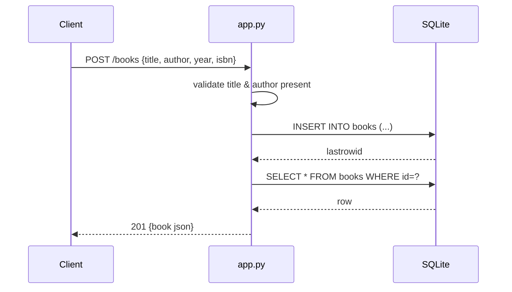

# Flow

A `POST /books` request parses the JSON body, rejects a missing/blank `title` or
`author` with `400`, then inserts the row into SQLite via a per-request
connection obtained from `get_db()` (stored on Flask's `g`, closed in
`teardown_appcontext`). The inserted row is re-selected and returned as JSON with
`201`. Persistence is real SQLite with WAL mode; validation is presence-only
(no type checks on `year`/`isbn`, no ISBN format validation). All handlers wrap
their body in a broad `try/except` that returns `500 {error: str(e)}`.
