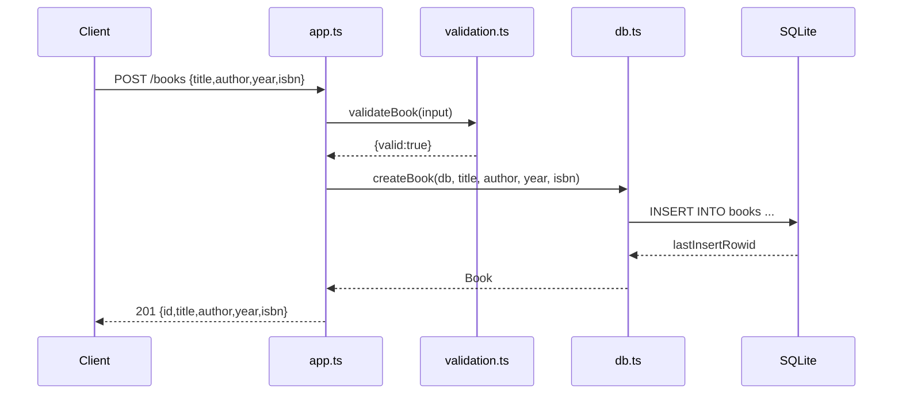

# Flow

A `POST /books` request is JSON-parsed by `express.json()`, validated by `validation.ts:validateBook` (rejects missing/blank title or author with `400`), then persisted by `db.ts:createBook` via a prepared `INSERT`. The handler returns the created book with `201`. Each route handler uses the `db` handle captured in the `createApp` closure; a parallel module-global handle (`setAppDb`/`getAppDb`/`shutdownDb`) exists but is not read by the route handlers. Notable: `createBook`/`updateBook` return `year: year ?? 0` and `isbn: isbn ?? ''` in their response object, while the persisted column is `NULL` when omitted — so the create-response representation of an omitted year/isbn (`0`/`""`) differs from what a later `GET` reads back (`null`).
