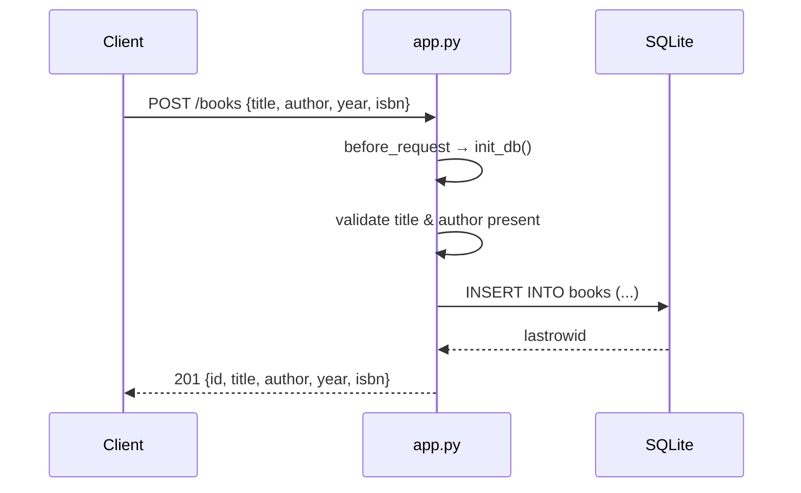

# Flow

A request to `POST /books` first passes through a `before_request` hook that calls
`init_db()` (a `CREATE TABLE IF NOT EXISTS`, executed on every request). The handler
requires a JSON body, rejects missing/blank `title` or `author` with 400, then inserts
the row into SQLite via a per-request connection stored on Flask's `g`, and returns the
created book with its generated id and a 201 status. The `?author=` list filter uses a
SQL `LIKE '%...%'` partial match rather than an exact match. Connections are opened lazily
in `get_db()` and closed in a `teardown_appcontext` hook.
