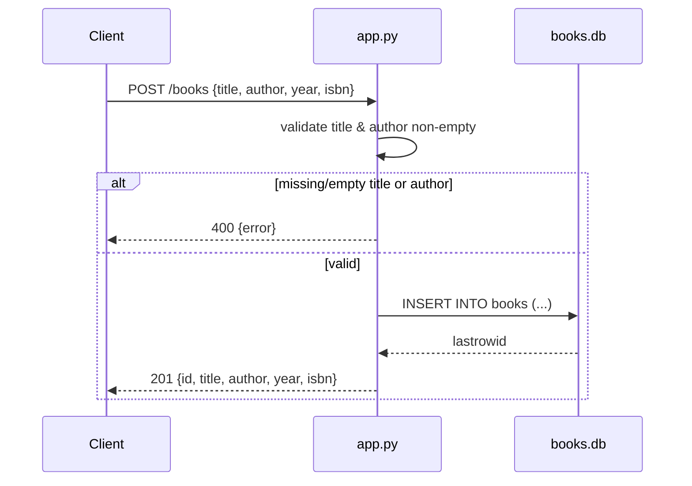

# Flow

A request to `POST /books` parses the JSON body, rejects it with 400 if the body
is not JSON or if `title`/`author` is missing or blank (whitespace-stripped),
otherwise inserts a row via a per-request SQLite connection (`get_db()`, WAL
mode) and returns the created book with 201. Connections are opened lazily on
`flask.g` and closed in `teardown_appcontext`. The `?author=` filter uses a
`LIKE %term%` substring match rather than exact equality. Validation is present
on both create and update; all read/write paths use parameterized queries.
