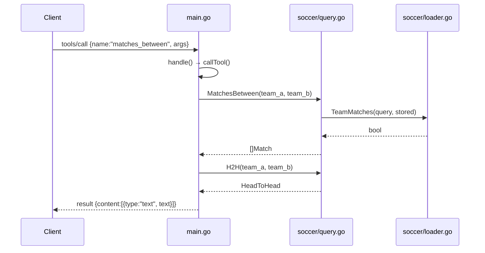

# Flow

At startup `main()` calls `soccer.LoadAll(dir)`, reading every CSV under `$SOCCER_DATA_DIR` (default `data/kaggle`) into an in-memory `DB` of matches and players. The server then reads newline-delimited JSON-RPC requests from stdin. A `tools/call` is dispatched by `callTool`, which invokes the relevant query function and formats the result as MCP text content. Team matching is fuzzy: names are lower-cased, diacritics stripped, club prefixes removed, and a 2-letter state suffix preserved so "Atletico-MG" ≠ "Atletico-PR". All queries run linearly over the in-memory slices — no indexing — and there is no date-range filter (only season/year). Data is loaded once; no persistence or external API calls.
