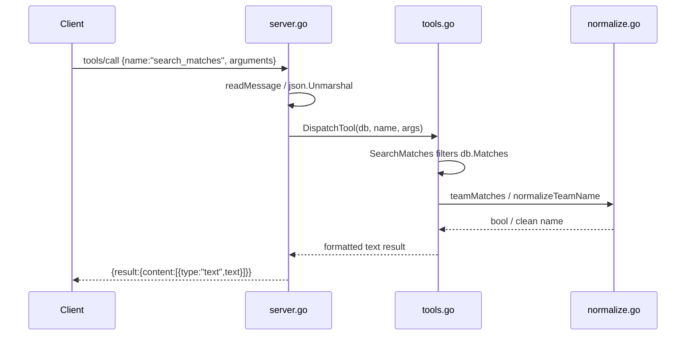

# Flow

On startup `main()` calls `Database.LoadAll`, parsing all 6 CSVs into in-memory slices (no index/DB). A `tools/call` request is read (framing auto-detected), unmarshalled, and routed by `DispatchTool` to the matching handler, which linearly scans `db.Matches` / `db.Players`, applies case-insensitive substring filters via `teamMatches`, sorts, truncates to `limit`, and returns a human-readable string wrapped in MCP `content`.

Notable: queries are O(n) full scans over ~24k matches / ~18k players (no indexing); team matching is substring-on-normalized-name and does **not** fold accents (so `"America"` ≠ `"América"`); date filtering is by season equality only, not arbitrary date ranges; results are plain formatted text, not structured JSON.
