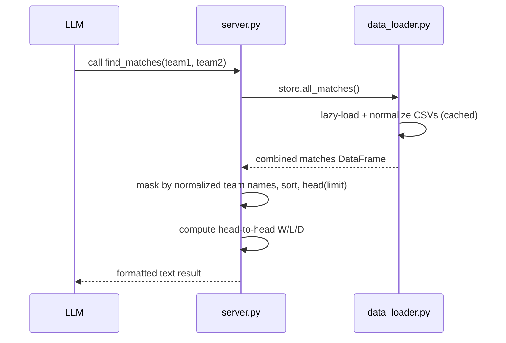

# Flow

A tool call to `find_matches` pulls the combined matches frame from the `DataStore`
singleton (each underlying CSV is lazily loaded and cached on first access).
Team filtering is done on `home_team_norm`/`away_team_norm` — accent-stripped,
state-suffix-stripped, alias-resolved names — via case-insensitive substring
matching. Results are sorted by datetime descending, truncated to `limit`, and
rendered to a human-readable string; when two teams are given an aggregate
head-to-head record is appended. All tools return formatted strings (not
structured JSON), and all computation is synchronous in-process pandas. Note:
team matching is substring-based, so short queries can over-match (e.g. a team
name that is a substring of another).
