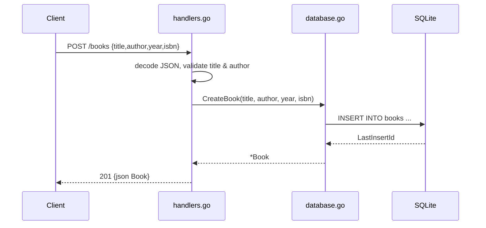

# Flow

A `POST /books` request is decoded into `CreateBookRequest`; `CreateBook` rejects empty title or author with `400` before touching the DB. On success it inserts a row (with server-set `created_at`/`updated_at`), reads back the generated id, and returns the full `Book` as `201`. Persistence is real SQLite via `mattn/go-sqlite3` with WAL mode; there is no pagination and list ordering is `created_at DESC`. Note: `scanBook` parses stored timestamps with the layout `"2006-01-02 15:04:05"`, which does not match go-sqlite3's default stored format, so `CreatedAt`/`UpdatedAt` on read paths may silently deserialize to the zero time (error ignored).
