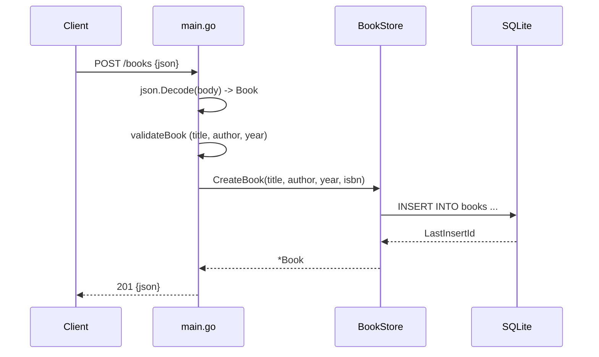

# Flow

A `POST /books` request is decoded into a `Book`, run through `validateBook` (rejects empty title, author, or zero year with 400), then inserted via `CreateBook`. A UNIQUE-constraint violation on ISBN is mapped to 409 Conflict by string-matching the error; other DB errors return 500. The generated ID is echoed back with 201. Data lives in an in-memory SQLite DB, so it does not persist across restarts. Validation additionally requires `year` (beyond the spec's title+author). The `{id}` router does not distinguish DELETE of a missing row (always 204).
