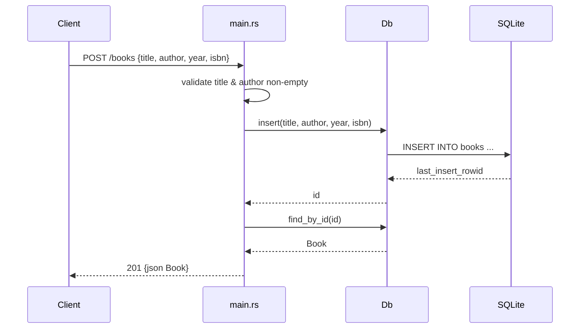

# Flow

A `POST /books` request is deserialized into `CreateBookRequest`; `create_book` rejects a missing/blank `title` or `author` with `400`, otherwise inserts the row into SQLite (via an `Arc<Mutex<Connection>>` shared connection) and re-reads it by id to return the persisted `Book` as `201`. Notable deviations: DB access is synchronous inside async handlers guarded by a single global `Mutex` (serializes all requests); `update_book` and `delete_book` call `db.find_by_id(id).unwrap()`, which would panic (not `500`) on a DB error.
