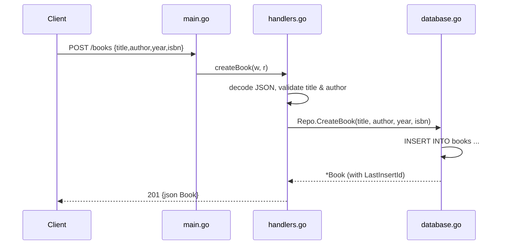

# Flow

A `POST /books` request is routed by the `/books` ServeMux entry in `main.go`, which dispatches on method to `handlers.go:createBook`. The handler decodes the JSON body into a `CreateBookRequest`, then validates that `title` and `author` are non-empty after `TrimSpace` (returning `400` with `{"error":...}` if either is missing). It calls `SQLiteRepo.CreateBook`, which runs a parameterized `INSERT` and reads back the generated ID via `LastInsertId()`, returning a populated `*Book` that is written back as `201 Created` JSON.

Notable deviations from common patterns: no ISBN/year validation (only title and author are checked); year and isbn are `NOT NULL` in the schema but default to Go zero values when omitted; a single shared `books.db` file is used (no in-memory or per-request isolation in production path); ID extraction uses raw prefix-trimming rather than a router with path params; `PUT` performs a read-then-write partial update with no transaction.
