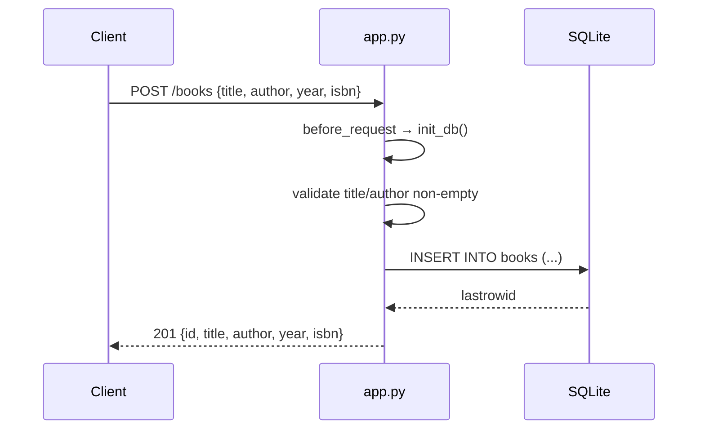

# Flow

A `POST /books` request first hits the `before_request` hook, which calls `init_db()` to `CREATE TABLE IF NOT EXISTS` (run on every request). The handler parses JSON, rejects a missing/blank `title` or `author` with 400, coerces `year` to int (400 on failure), then inserts via a per-request SQLite connection obtained from `get_db()` (stored on `flask.g`, closed at teardown). A duplicate `isbn` raises `sqlite3.IntegrityError` and returns 409. On success it returns 201 with the created record. Notable deviations: `init_db()` re-runs on every request rather than once at startup; the `?author=` filter uses substring `LIKE` matching rather than exact match.
