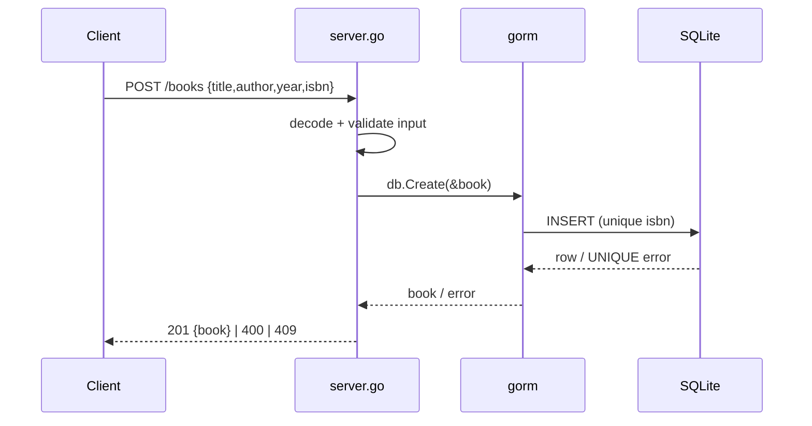

# Flow

A `POST /books` request is decoded into a `BookInput`, validated (title, author, and isbn non-empty; year > 0), then persisted via GORM into SQLite. A `UNIQUE constraint failed` on isbn maps to `409 Conflict`; other DB errors map to `500`. Path-based routes (`/books/{id}`) parse the id with `strconv.Atoi` on a `strings.TrimPrefix` of the URL path rather than using Go 1.22's `PathValue`. Validation exceeds the spec (year and isbn are also required, isbn uniqueness enforced), and errors are returned as JSON with appropriate status codes.
