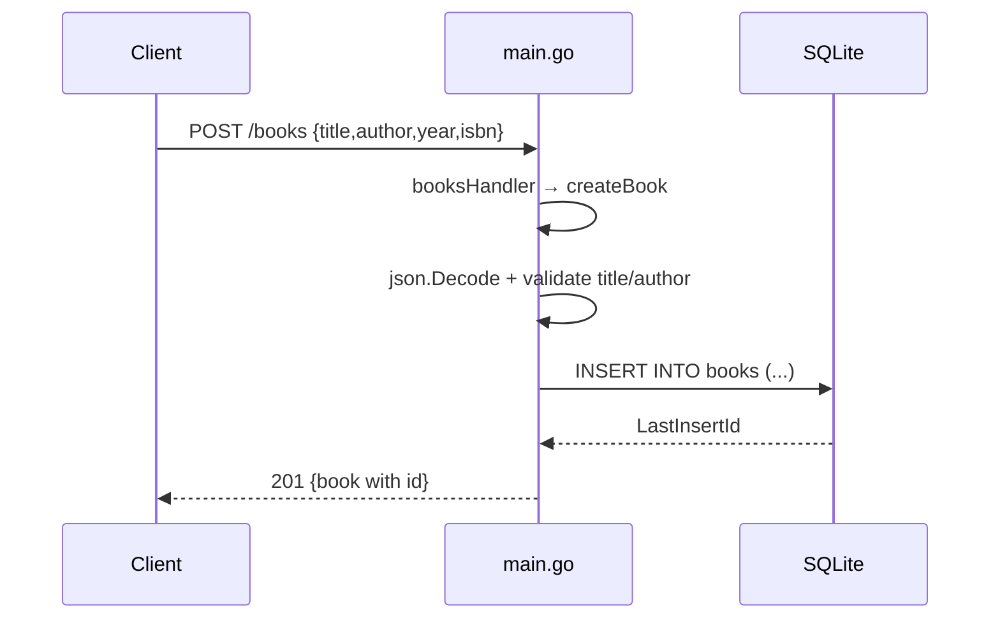

# Flow

A `POST /books` request is routed by `booksHandler`, which dispatches on method to `createBook`. The body is JSON-decoded into a `Book`; empty `title` or `author` yields a `400`. Otherwise the row is inserted into the SQLite `books` table, the generated id is read back via `LastInsertId()`, and the created book is returned as `201`. Validation covers only presence of title/author (year/isbn optional, no format checks). Errors from the DB layer are surfaced as `500` with the raw error string. Note: `updateBook` echoes the decoded request body rather than the persisted row, so its response `id` reflects the client payload, not the path id.
