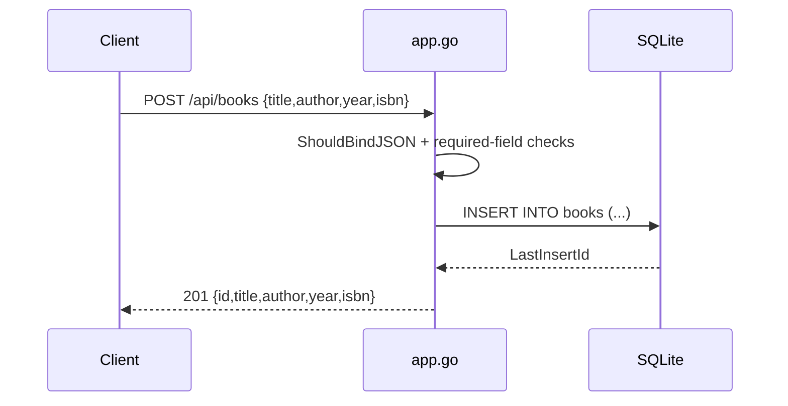

# Flow

A `POST /api/books` request is bound into `BookInput` (all four fields flagged
`required` via gin binding), then re-checked for empty title/author before an
`INSERT` into the SQLite `books` table; the new id is returned with 201. Reads
(`GetBooks`, `GetBook`) query the same table directly; `GetBooks` branches on the
`author` query param. Notable: routes are served under `/api` while the spec and
tests use root paths; year/isbn are required beyond the spec; the explicit empty
checks are unreachable because binding already rejects empties.
