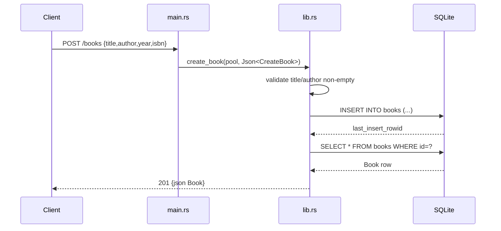

# Flow

A `POST /books` deserializes the JSON body into `CreateBook` (a missing `title`/`author` fails serde deserialization → 400), rejects empty `title`/`author` with `BookError::Validation` (400), then `INSERT`s the row and re-`SELECT`s it by `last_insert_rowid` to return the created `Book` with `201`. The single `rusqlite::Connection` is shared through an `Arc<Mutex<..>>`, so every handler serializes on one lock (no connection pool). Notable deviations: whitespace-only titles pass validation; `update_book` builds a dynamic `UPDATE` using fixed numbered placeholders (`?1..?4`) but only binds the present fields, which breaks non-prefix partial updates.
