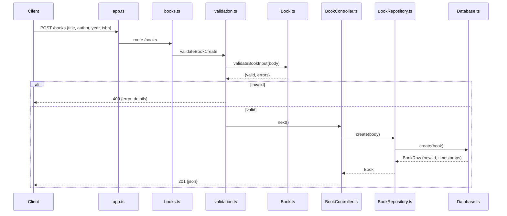

# Flow

A `POST /books` request is JSON-parsed, then run through `validateBookCreate` middleware which delegates to the model's `validateBookInput`. On failure it returns `400` with a details array. On success, `BookController.create` calls `bookRepository.create`, which delegates to the in-memory `DatabaseManager.create`; the store assigns an auto-incremented `id` (max existing id + 1), stamps `createdAt`/`updatedAt`, pushes to an in-memory array, and returns the new record with `201`.

Deviations from common patterns: storage is a plain in-memory JS array, not SQLite (task asked for SQLite or embedded-DB equivalent); persistence is optional JSON-file writes gated on a non-`:memory:` `DB_PATH`. The author filter is exact-match, not substring. All DB operations are synchronous. The `create` handler is not wrapped in try/catch, relying on the global error middleware for unexpected failures.
