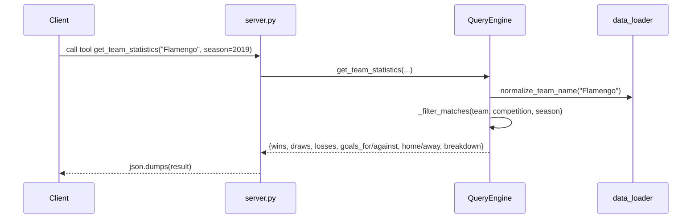

# Flow

At import time `server.py` builds the unified match DataFrame (`get_match_data()`, concatenating and sorting 5 match CSVs) and the FIFA player frame (`get_player_data()`) once, then constructs a single `QueryEngine`. Each MCP tool is a thin wrapper that calls one engine method and returns `json.dumps(...)`. Aggregations iterate rows in Python (`iterrows`) rather than vectorized pandas, and team names are normalized (state-suffix stripping) at load and query time. Notable: standings/averages keyed by an exact lowercase competition string, so overlapping Brasileirão datasets are aggregated together (see evaluation findings); no error handling around missing CSV columns beyond per-loader try/except in `load_all_match_data`.
