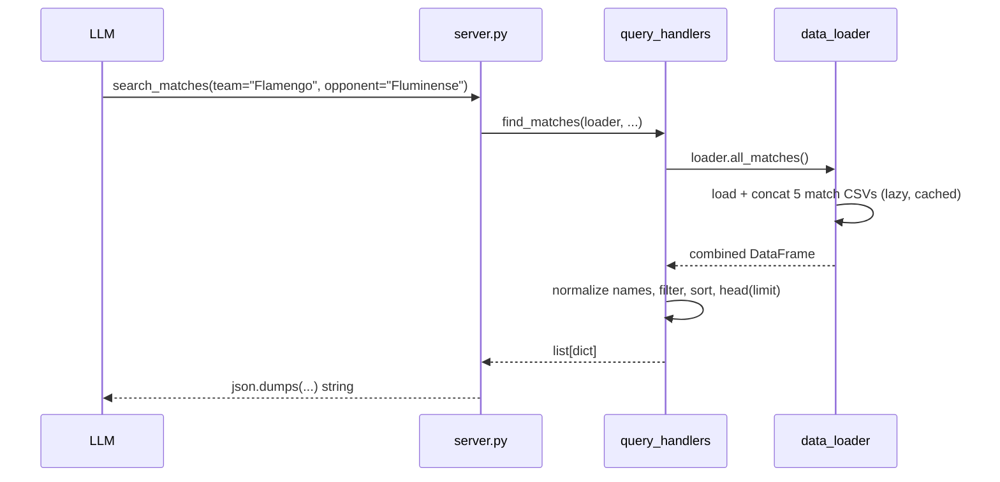

# Flow

A tool call arrives at a `@mcp.tool()` function in `server.py`, which delegates to a pure function in `query_handlers.py`. That function pulls the combined match frame from the module-global `DataLoader` (each CSV loaded lazily and cached on first access via `@property`), normalizes team names with `normalize_team_name()` (strips `-SP`/`-RJ` state suffixes), applies substring/season/date filters, and returns plain dicts. `server.py` serializes with `json.dumps(..., ensure_ascii=False)` to preserve Portuguese accents.

Notable deviations: `all_matches()` re-concatenates all five frames on every call (no combined-frame caching), and `find_matches` applies `.head(limit)` **before** `sort_values('date')`, so results are truncated prior to sorting rather than after — the newest matches may not be the ones returned.
