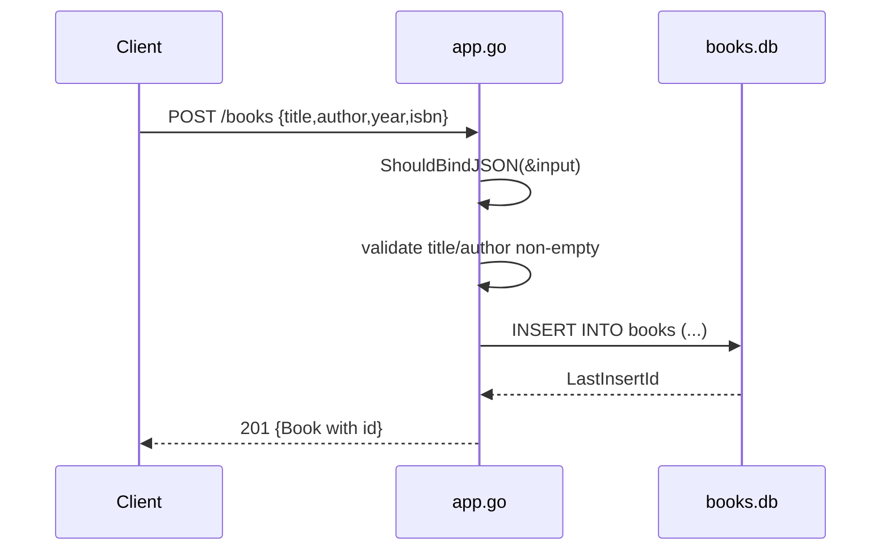

# Flow

A `POST /books` request is bound from JSON into a `Book` struct, then validated: an empty `title` or `author` returns `400`. On success the handler executes a parameterized `INSERT` against the SQLite `books` table, reads back the generated row id, and returns `201` with the created book as JSON. Read/update/delete routes parse `:id` with `strconv.Atoi` (bad id → `400`) and distinguish missing rows via `sql.ErrNoRows`/`RowsAffected() == 0` → `404`. Validation is limited to presence of title/author; no ISBN format, year range, or uniqueness checks. DB access is synchronous and uses a single package-level `*sql.DB`.
