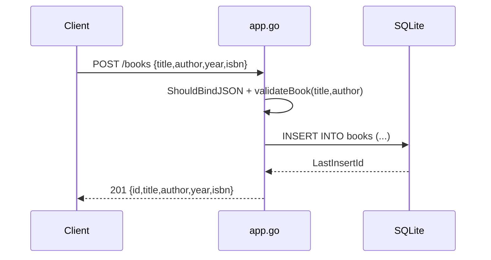

# Flow

A `POST /books` binds the JSON body, runs `validateBook` (rejecting empty title/author with 400), then inserts a row into the SQLite `books` table and returns the created record with `201`. Validation covers only title/author — `isbn` is unchecked at the handler despite being `NOT NULL UNIQUE` in the schema, so a duplicate/omitted isbn surfaces as a generic `500 failed to create book` rather than a `400/409`. `updateBook` fetches the existing row and applies pointer-based partial updates before re-validating.
