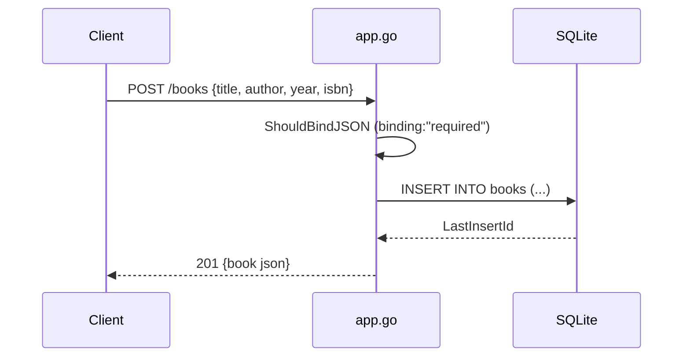

# Flow

A `POST /books` request is bound into `CreateBookRequest` where Gin enforces `title` and `author` as required (returning 400 on failure). The handler executes a parameterized `INSERT` against the SQLite `books` table, reads back the auto-generated id via `LastInsertId()`, and returns the full `Book` as JSON with status 201. All handlers follow the same pattern: bind/validate → parameterized SQL → JSON response with an appropriate status code. Errors return `{error}` with 400/404/500 as appropriate. DB access is synchronous through a single global `*sql.DB`.
