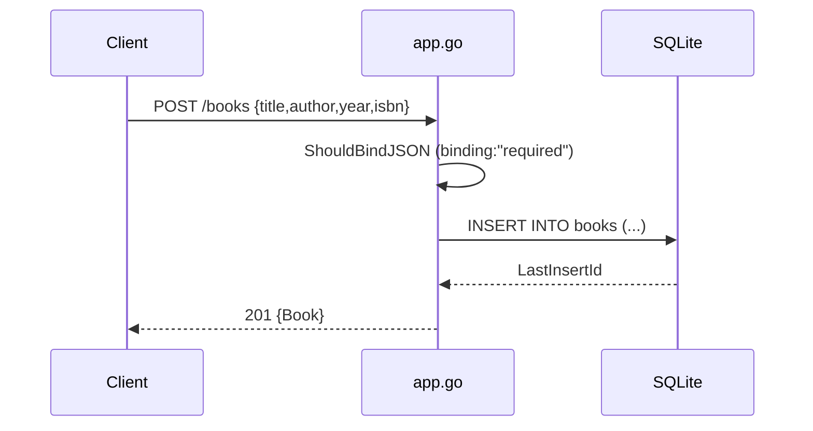

# Flow

A `POST /books` request is bound into `CreateBookRequest`, where Gin enforces `title` and `author` as required — a missing field short-circuits to `400`. On success the handler executes a parameterized `INSERT` against the on-disk SQLite DB (`./books.db`), reads back the generated id, and returns the full `Book` as `201 Created`. Reads (`GET`), updates (`PUT`), and deletes (`DELETE`) follow the same pattern: an existence check via `QueryRow` (returning `404` on `sql.ErrNoRows`) followed by the mutation. All queries are parameterized; there is no pagination and the `?author=` filter is an exact-match equality on the `author` column.
