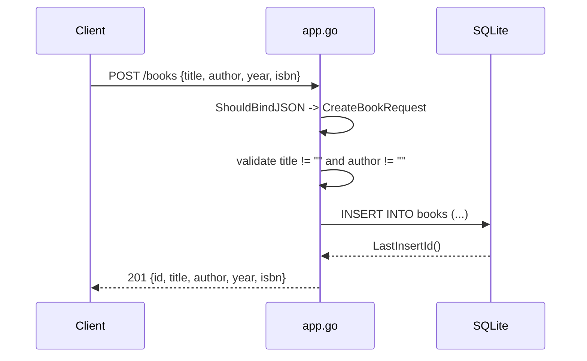

# Flow

A request to `POST /books` is bound into a `CreateBookRequest` via Gin's `ShouldBindJSON` (which enforces the `binding:"required"` tags on title/author), then re-validated with explicit non-empty checks that return `400` on failure. On success the handler runs a parameterized `INSERT` against the global `*sql.DB` and returns `201` with the new row assembled from `LastInsertId()` plus the request fields.

Notable characteristics:
- Single global `db *sql.DB`; handlers use it directly (no dependency injection), so tests overwrite the package-level `db` variable with a test DB.
- Validation is doubled: struct `binding:"required"` tags plus manual empty-string checks — either can produce the `400`.
- SQL uses parameterized queries throughout (no string concatenation).
- `PUT /books/:id` does a read-modify-write: it SELECTs the existing row and treats empty strings / zero year as "keep existing", so year `0` and empty fields cannot be set explicitly.
- Synchronous, blocking DB calls in each handler; no pagination, no auth, no request logging beyond Gin's default middleware.
