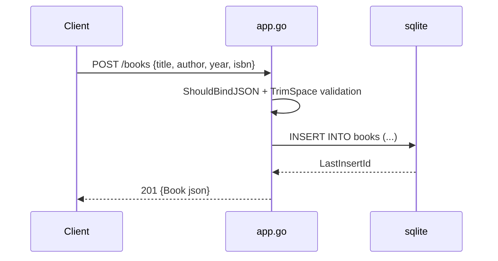

# Flow

A `POST /books` binds the JSON body into `CreateBookRequest` (with Gin `binding:"required"` on title/author), then re-checks title and author for whitespace-only values, inserts a row into the SQLite `books` table, and returns the created `Book` with its generated id and HTTP 201. Read/update/delete handlers follow the same pattern: parse `:id`, existence-check with `QueryRow`, act, and return JSON with 200/400/404/500 as appropriate. DB access is synchronous per request against a single global `*sql.DB`.
