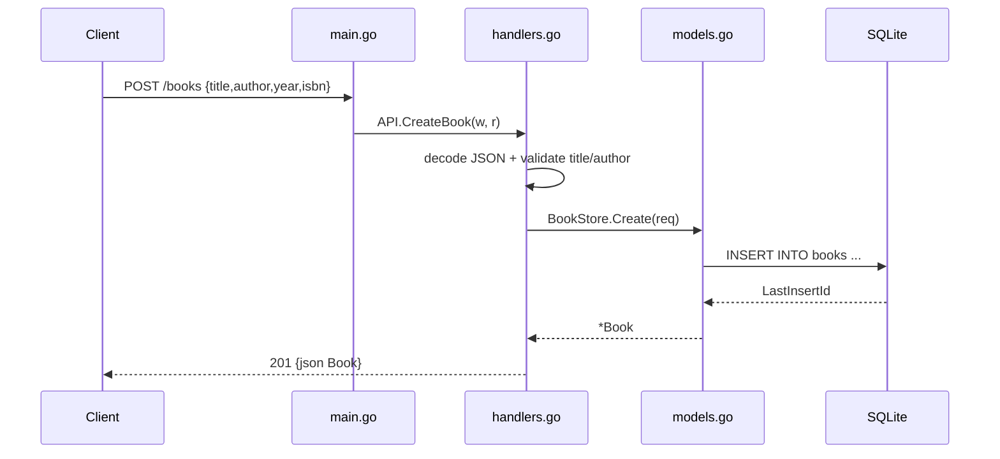

# Flow

A `POST /books` request is routed by the Go 1.22 method-aware `ServeMux` to `API.CreateBook`, which decodes the JSON body, rejects empty `title` or `author` with `400`, then calls `BookStore.Create` to `INSERT` a row into the SQLite `books` table. A `UNIQUE` violation on `isbn` is surfaced as `409 Conflict`; success returns `201` with the created book (including generated id and created_at). Persistence is a real embedded SQLite file (`modernc.org/sqlite`, pure-Go), not in-memory state.
