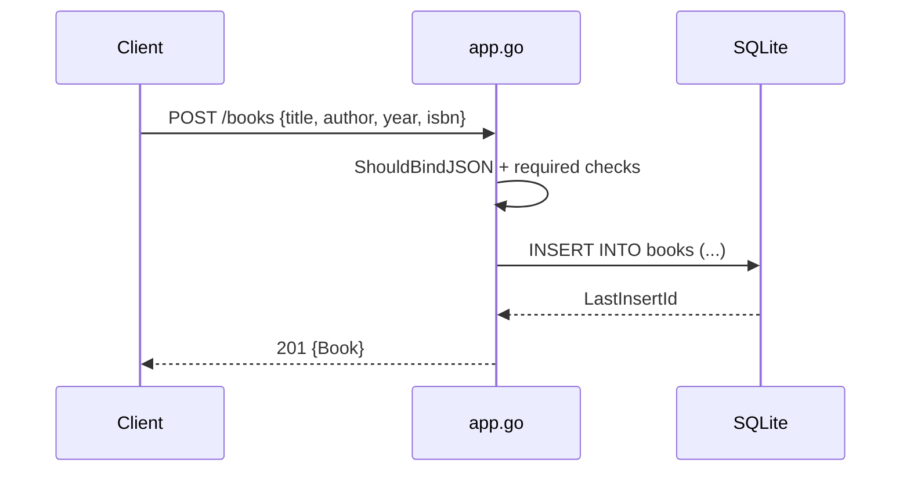

# Flow

A `POST /books` request is bound into `CreateBookRequest` via Gin's `ShouldBindJSON`, which enforces the `binding:"required"` tags on title and author; the handler additionally re-checks both for empty strings before inserting. On success it runs an `INSERT` against the file-backed SQLite database, reads back the autoincremented id, and returns `201` with the created book as JSON. Validation failures return `400`; DB errors return `500`. Persistence is durable SQLite (file `books.db`), not in-memory. Note: the global `db` handle is shared and the DB file name is hard-coded, so the running server and the test suite use separate files (`books.db` vs `test_books.db`).
