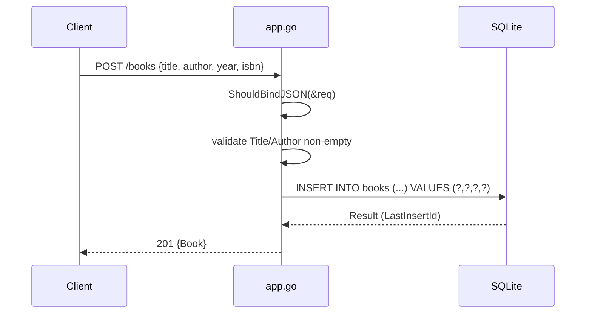

# Flow

A `POST /books` request is bound from JSON into a `CreateBookRequest`. On a bind error the handler returns `400 {"error": "Invalid request body"}`. It then checks `Title` and `Author` are non-empty (each returning its own `400` on failure), runs a parameterized `INSERT`, reads `LastInsertId()`, and returns the created `Book` (including its DB-assigned `ID`) with `201`. Database errors surface as `500`.

Deviations from common patterns: no request-level model binding tags (validation is manual, not via gin `binding:"required"`); each request opens no explicit transaction; the DB path is hardcoded (`books.db`) and the connection is a single shared `*sql.DB` with no connection pooling tuning; `year`/`isbn` are accepted without validation; `main()` runs Gin in release mode with only the Recovery middleware (no logging middleware).
