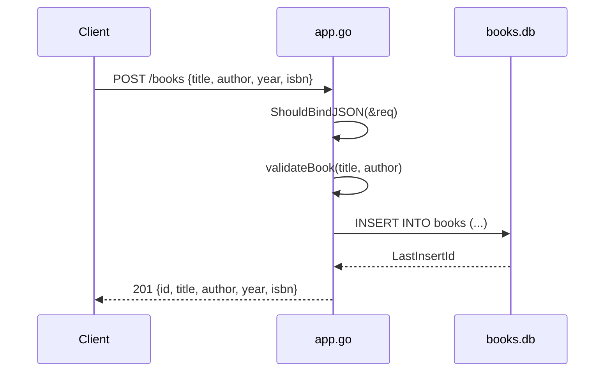

# Flow

A `POST /books` request binds the JSON body into a `CreateBookRequest`, rejecting malformed JSON with `400`. It then calls `validateBook`, which requires non-empty `title` and `author` (missing either yields `400`). A valid request runs a parameterized `INSERT` against the SQLite `books.db` file, reads back the auto-increment ID via `LastInsertId()`, and returns the full `Book` as `201 Created`.

Deviations from common patterns:
- `validateBook` returns its error as a message string with a nil error (the second return value is never used), rather than a real `error`.
- No validation of `year` or `isbn`; `year` defaults to `0` and `isbn` may be empty (only the DB UNIQUE constraint distinguishes duplicates, surfaced as a generic `500`).
- Single global `*sql.DB`; DB access is synchronous within each handler. No pagination or limit on `GET /books`.
- SQLite file is hardcoded (`./books.db`) and persists across runs; tests use `TestMain` to set up an isolated DB.
