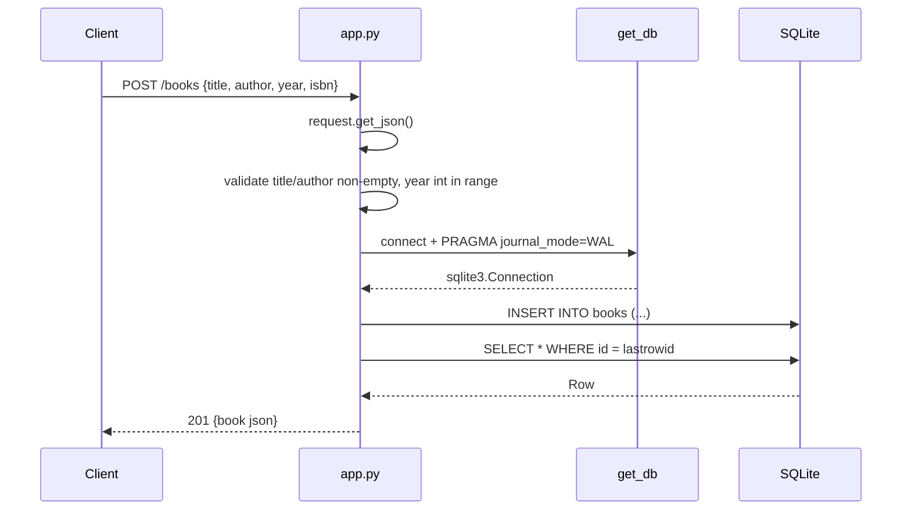

# Flow

A `POST /books` request parses the JSON body, rejecting a missing or empty
body with 400. It validates that `title` and `author` are non-empty strings
(400 otherwise) and, if `year` is present, coerces it to an int within 0–2100
(400 otherwise). It then opens a per-request SQLite connection via `get_db()`
(lazily stored on Flask's `g`, closed in a `teardown_appcontext` hook), inserts
the row, re-selects it by `lastrowid`, and returns the serialized book with 201.
Notable: no ORM (raw `sqlite3`); the DB file is created only when `init_db()`
runs (in `__main__` or the test fixture), so requests assume the table exists;
title/author are `.strip()`-ped before insert; the `?author=` filter uses an
unanchored `LIKE` substring match rather than exact equality.
