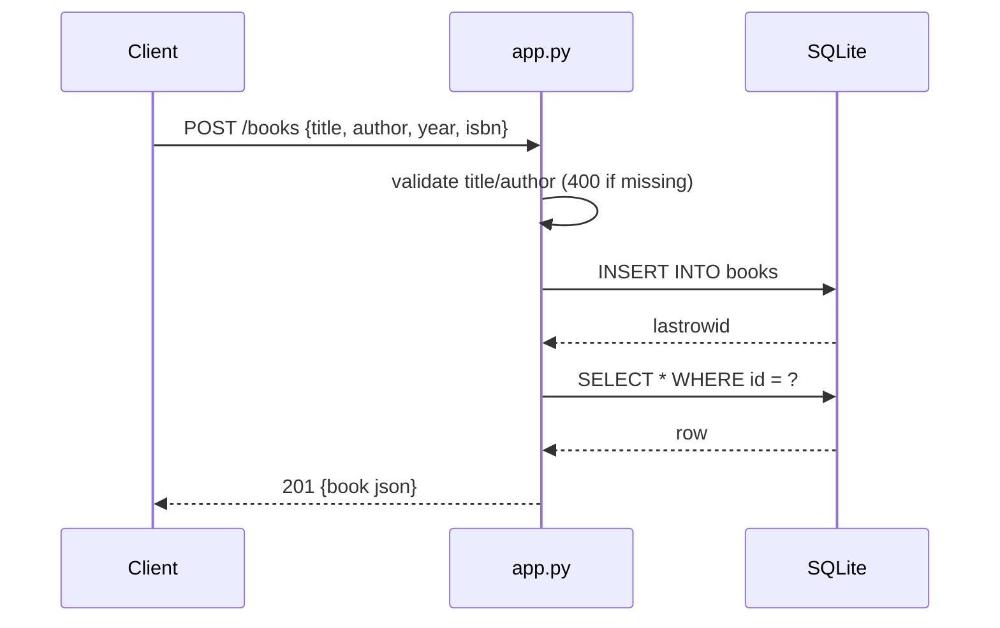

# Flow

A `POST /books` parses the JSON body, rejects missing/blank `title` or `author` with 400, coerces `year` to int (400 on failure), inserts the row into SQLite via a per-request connection (`get_db()` stored on Flask `g`, closed at teardown), then re-selects the inserted row and returns it as JSON with 201. Input validation is present; the author filter uses a `LIKE %...%` substring match. No pagination, no auth.
