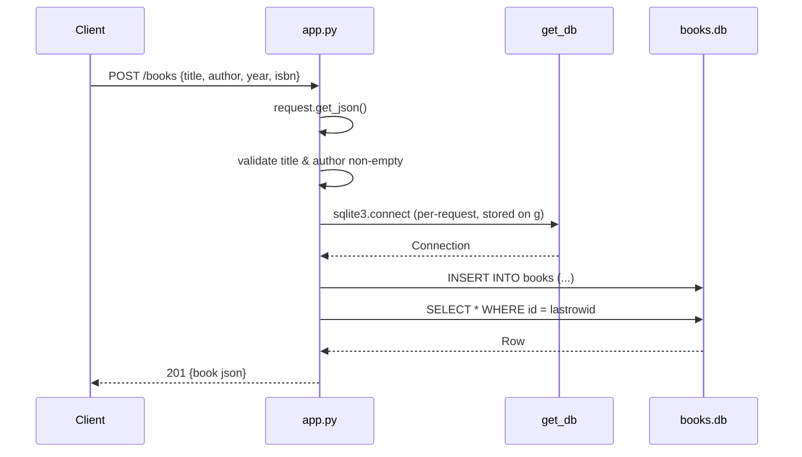

# Flow

A `POST /books` parses the JSON body, rejecting a missing/empty body with 400. It requires non-empty `title` and `author` (stripped strings), returning 400 otherwise; `year`, if present, is coerced to int (400 on failure). It opens a per-request sqlite3 connection cached on Flask's `g`, inserts the row, re-selects it by `lastrowid`, and returns it as JSON with 201. The connection is closed in a `teardown_appcontext` hook.

Deviations from common patterns:
- Raw `sqlite3` with hand-written SQL — no ORM. Parameterized queries are used (no injection).
- No unique-constraint error handling: a duplicate `isbn` raises `sqlite3.IntegrityError` and surfaces as an unhandled 500.
- `POST`/`PUT` with no body: since handlers call `request.get_json()` (silent-off by default), a missing/non-JSON body raises 415 (Unsupported Media Type) before the `if not data` check runs — the test suite asserts 415 for this case.
- Database schema is initialized at module import (`init_db()` call at top level), not behind a guard.
- `list_books` author filter uses substring `LIKE` matching, not exact match.
