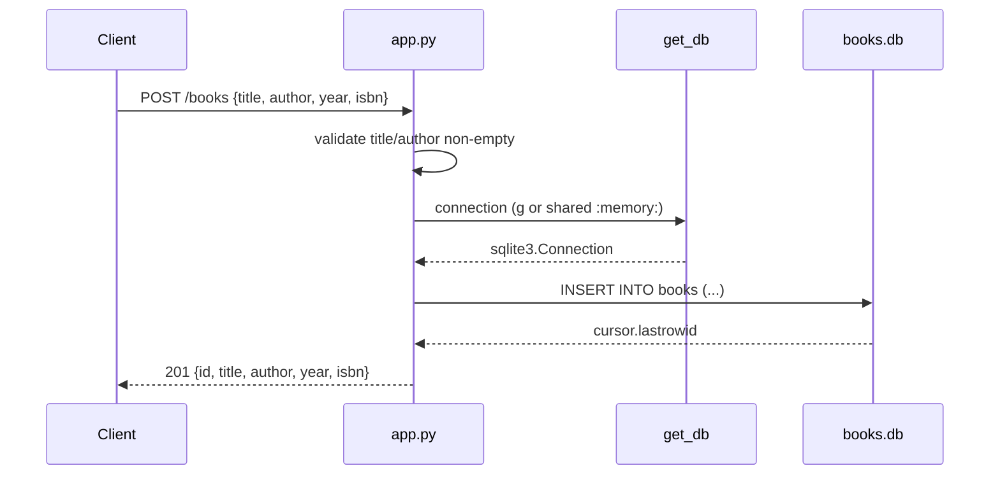

# Flow

A `POST /books` request parses JSON, rejects missing/blank `title` or `author` with 400, then obtains a SQLite connection via `get_db()` (a per-request connection stored on Flask's `g` for file-based DBs, or a single shared connection for `':memory:'`). It inserts the row, commits, and returns the created book with its generated id at 201. Author filtering on `GET /books` uses `LIKE '%author%'` (substring match). No pagination.
