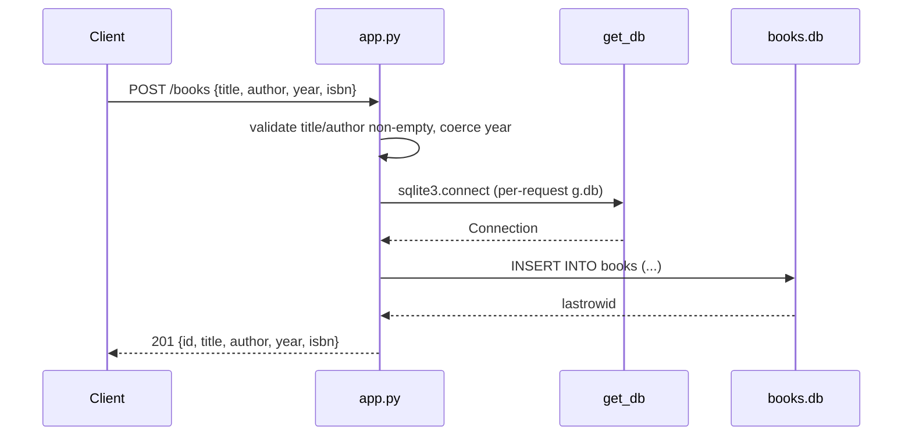

# Flow

A `POST /books` request parses the JSON body, rejects missing/blank `title` or `author` with 400, and coerces a provided `year` to int (400 if non-integer). It opens a per-request SQLite connection cached on Flask's `g`, inserts the row, commits, and returns the created book with its new id and status 201. The connection is closed in a `teardown_appcontext` handler. Reads (`list_books`, `get_book`) and mutations (`update_book`, `delete_book`) follow the same connection pattern; `list_books` applies a case-preserving `LIKE '%author%'` filter when `?author=` is present. Notable: partial-update semantics on PUT (missing fields default to existing row values); `LIKE` filter is substring rather than exact match.
