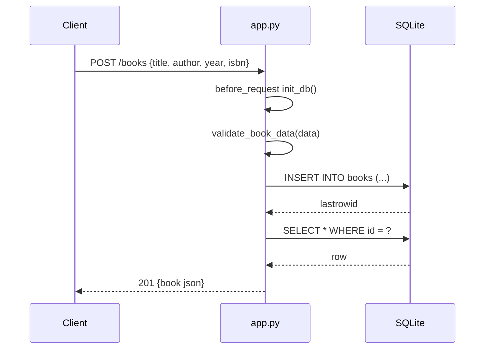

# Flow

A request to `POST /books` first runs the `before_request` hook (`ensure_tables` → `init_db()`), which recreates the table if absent on every request. The handler parses JSON, validates that `title`/`author` are non-empty (and `year`, if present, is an int in 0–2100), inserts the row via a per-request connection stored on Flask's `g`, re-reads the inserted row, and returns it as JSON with 201. The connection is opened lazily by `get_db()` and closed in the `teardown_appcontext` hook. Notable: `init_db()` opens a fresh connection on every request rather than once at startup; author filtering uses a substring `LIKE %...%` match rather than exact equality.
