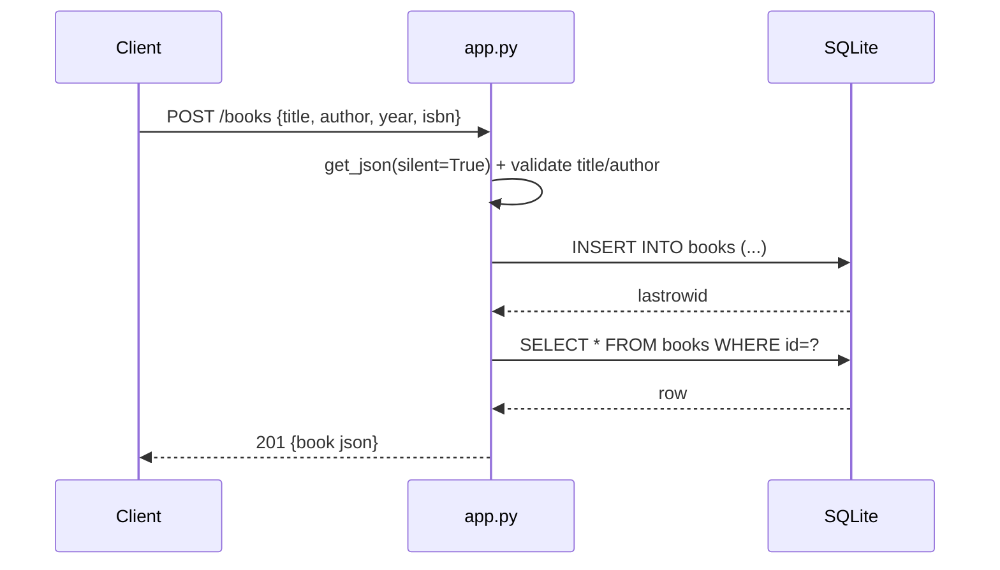

# Flow

A `POST /books` parses the JSON body (returning 400 if the body is missing or
empty), requires non-empty string `title` and `author`, coerces an optional
`year` to int (400 on failure), then inserts a row. A duplicate `isbn` violates
the UNIQUE constraint and is caught as `sqlite3.IntegrityError`, returning 409.
The inserted row is re-read and returned as JSON with 201. A per-request DB
connection is opened via `g` and closed on `teardown_appcontext`. Beyond the
task spec, the handler adds duplicate-ISBN 409 handling and integer year
validation.
