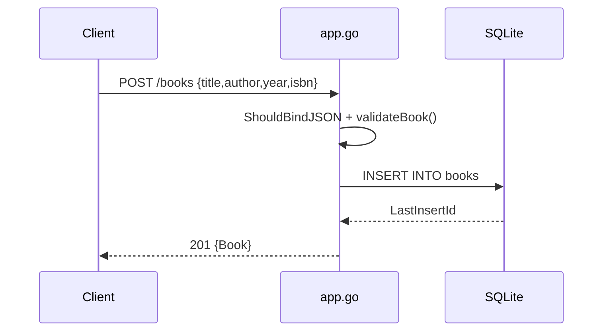

# Flow

A `POST /books` request binds the JSON body into `CreateBookRequest`, validates that title and author are non-empty (trimmed), then inserts a row into the SQLite `books` table and returns the created `Book` with its new id as `201`. Validation failures return `400`; DB errors return `500`. A DB handle is a package-level global (`db`) opened once in `initDB`; year defaults to `2000` when omitted/zero. Tests swap this global to a temp `test_books.db` via wrapper closures in `createRouterWithTestDB`.
