# Flow

```mermaid
sequenceDiagram
    Client->>app.py: POST /books {title, author, year, isbn}
    app.py->>app.py: validate title/author non-empty str
    app.py->>get_db: sqlite3.connect (per-request, g.db)
    get_db-->>app.py: Connection
    app.py->>books.db: INSERT INTO books (...)
    books.db-->>app.py: lastrowid
    app.py-->>Client: 201 {id, title, author, year, isbn}
```

A `POST /books` request parses the JSON body, rejects it with 400 if `title` or
`author` is missing/blank/non-string, then obtains a per-request SQLite
connection cached on Flask's `g`, inserts the row, commits, and returns the
created book with its new id and a 201 status. The connection is closed in a
`teardown_appcontext` hook. Validation is present on both create and update;
update falls back to existing field values for any omitted keys. Access is
synchronous SQLite with no pagination on the list endpoint.
