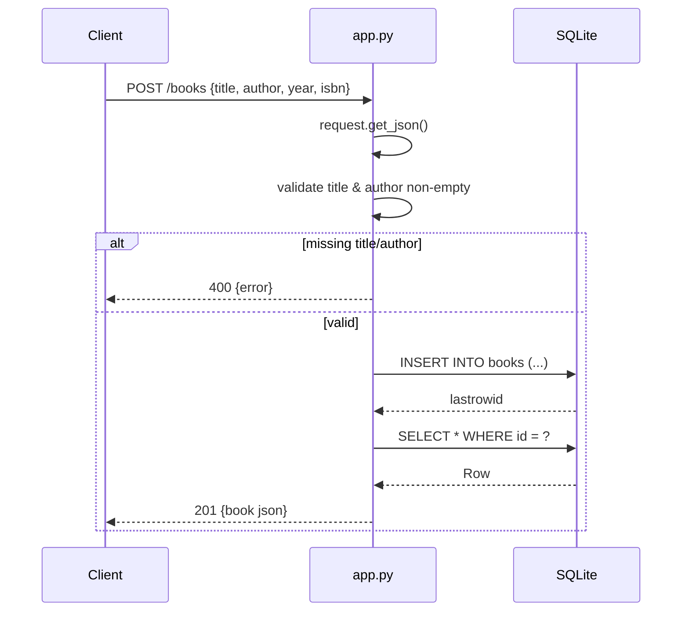

# Flow

A request to `POST /books` parses the JSON body, rejects it with 400 if `title`
or `author` is missing/blank (after stripping whitespace), then inserts the row
into the request-scoped SQLite connection (`get_db()` on Flask `g`, WAL mode),
re-selects the inserted row by `lastrowid`, and returns it as JSON with 201. The
connection is closed in a `teardown_appcontext` hook. Notable: string coercion
and whitespace-stripping on title/author; `?author=` list filter uses a
substring `LIKE %author%` match rather than exact equality.
