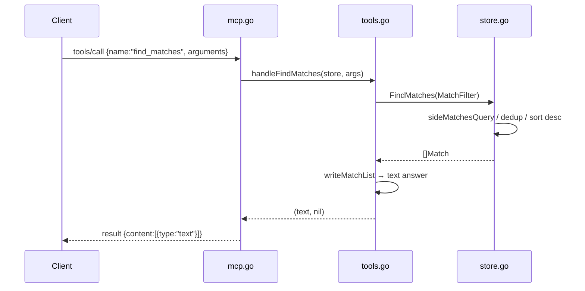

# Flow

At startup `main()` calls `LoadAll("data/kaggle")`, parsing all six CSVs into normalized `Match`/`Player` values and building name-resolution indexes (`Store.Index`). A client then drives the server over stdio: after the `initialize` handshake it issues `tools/call`. `mcp.go` dispatches to the named handler in `tools.go`, which coerces the loosely-typed JSON arguments, runs a query against the in-memory `Store`, and formats a concise text response. Tool execution errors are returned as a successful JSON-RPC result with `isError:true` (per MCP convention) rather than a protocol error.

Notable: pure stdlib, no external dependencies (no MCP SDK — protocol hand-implemented). Team-name normalization (accent folding + state-suffix handling) and cross-dataset de-duplication via `Match.signature()` are the main correctness-sensitive paths. Standings deliberately compute from a single highest-priority source per competition/season to avoid double-counting overlapping Brasileirão datasets.
