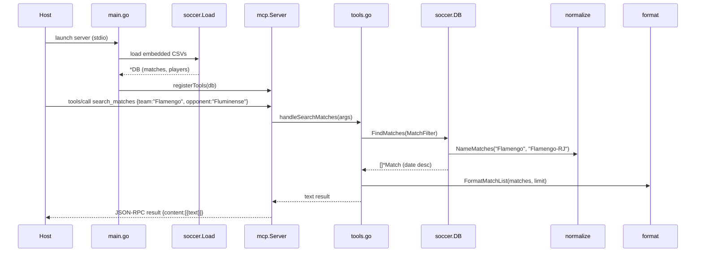

# Flow

At startup `main.go` loads the six embedded Kaggle CSVs through `soccer.Load`, which parses each file's distinct schema (Portuguese columns, DD/MM/YYYY dates, float-formatted goals, UTF-8 BOM), canonicalizes team names, and de-duplicates fixtures by keeping a single authoritative source per (competition, season) bucket. The seven tools are registered on a stdlib-only MCP stdio server. A `tools/call` is decoded into a typed filter, run against the in-memory slices with accent-insensitive name matching, and rendered to text by `format.go`. All diagnostics go to stderr so they never corrupt the JSON-RPC stream on stdout. No external network calls, no database — purely in-memory over embedded data.
