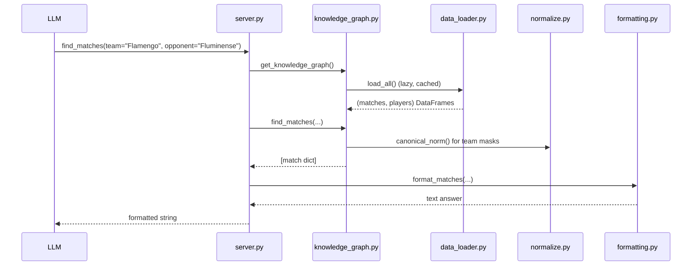

# Flow

The first tool call triggers a lazy, cached load of the six Kaggle CSVs into two
DataFrames (`data_loader.load_all`), so start-up is instant and the heavy parse
happens once. Each tool is a thin adapter: it forwards validated arguments to a
`KnowledgeGraph` method, which filters/aggregates the normalised tables using
accent- and suffix-insensitive team masks from `normalize.py`, then renders the
plain dict/list result to text via `formatting.py`. All business logic lives in
`KnowledgeGraph` (transport-agnostic), which is why the suite can test it without
a running server. Overlapping Série A sources are deduplicated by source priority
at load time so standings/aggregate stats are not inflated by duplicate fixtures.
