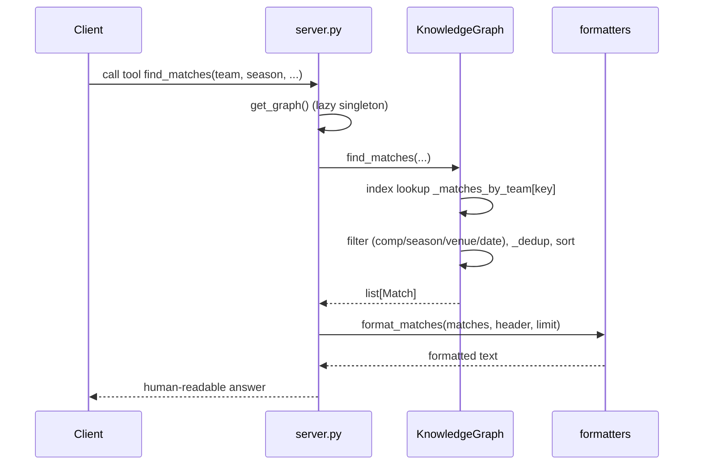

# Flow

An MCP client invokes a registered tool (e.g. `find_matches`). The server resolves
the shared `KnowledgeGraph` via a lazy singleton (`get_graph()`), which on first use
loads all six CSVs through `data_loader` and builds team/club/nationality indexes.
The query filters an index-narrowed candidate set, deduplicates fixtures that appear
in multiple source files (by `(competition, season)` source priority), sorts most-
recent-first, and the result is rendered by `formatters` into the answer format shown
in TASK.md. All work is in-memory, satisfying the spec's <2s/<5s latency targets.

Notable: team names are normalized (state suffix + accent stripping) so the same club
matches across datasets; cross-source duplicate fixtures are collapsed before
aggregation; goals/dates that are blank or malformed degrade to `None` rather than
raising. The server import-guards `mcp` so the engine and tests run without the MCP
package installed.
