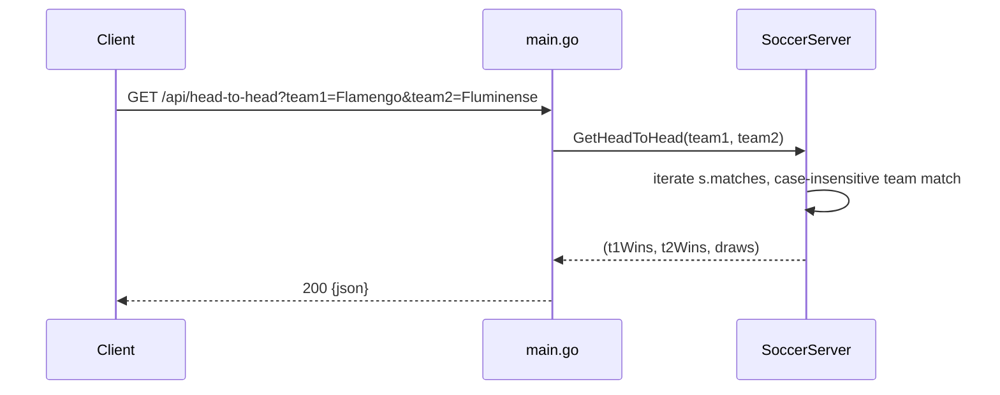

# Flow

A request hits a `HandleFunc` handler, which reads query params, calls the matching
`SoccerServer.GetX` method (a linear scan over `s.matches` or `s.players`), and JSON-encodes
the result. Team matching is case-insensitive exact-match on the already-normalized team name.

**Startup data flow:** `main()` → `LoadData(dataDir)` → six per-file loaders. Each loader opens
the CSV, `ReadAll()`, skips the header, and appends structs.

**Deviations from common patterns:**
- **No MCP protocol** — REST only, despite a task that asks for an MCP server with registered tools.
- **`fifa_data.csv` is silently dropped**: `loadPlayers` guards `if len(record) < 100 { continue }`,
  but the file has **89 columns**, so *every* player row is skipped → **0 players loaded** at runtime
  (`main.go:493`). All player endpoints return `[]` against the real dataset.
- **FIFA column indices are mis-mapped** even past the guard: `Age`/`Overall`/`Potential` read the
  wrong columns (`main.go:498,499,500,541` — Age reads the Name column, Overall reads the Flag column).
- **Extended-stats columns mis-mapped**: `totalCorners`/`ht_result`/`at_result` read the wrong indices
  in `loadExtendedMatches` (`main.go:387,410,411` — file has ht_result at col 15, at_result 16,
  total_corners 17, but code uses 15/14/15).
- **Tests never exercise the CSV loaders** — every test injects synthetic structs, so the loader bugs
  above are invisible to the suite (coverage 43.5%).
- No pagination, no input validation beyond required-param checks, synchronous linear scans.
