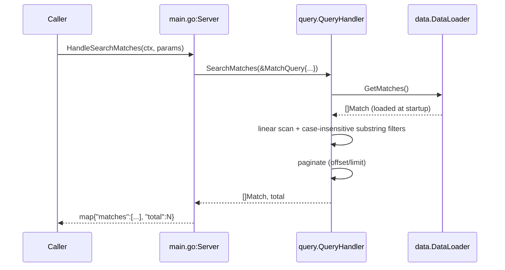

# Flow

The dominant flow is an in-process query. At startup `NewServer()` calls
`DataLoader.LoadAll()`, which reads all 6 CSVs into slices held in memory. A caller
invokes one of the ten `Handle*` methods with a `map[string]interface{}` param bag;
the handler unpacks it into a typed query struct and delegates to `QueryHandler`,
which does an O(n) scan over the in-memory match/player slices with
`strings.Contains`/`EqualFold` filters, then returns Go maps.

Notable deviations from a working MCP server:
- **No transport.** Nothing serves these handlers — no MCP JSON-RPC/stdio, no HTTP
  listener. `Run()` returns immediately and `main()` blocks on `select {}` doing nothing.
- **No tool registration/schemas.** The param bags are untyped; there are no advertised
  tool definitions a client could discover or call.
- **Type-fragile params.** Numeric params (`limit`, `offset`, `min_overall`) are read via
  `.(int)`; a JSON transport would deliver `float64`, so these would silently fall back to
  defaults.
- **Data path is relative** (`data/kaggle`), resolved from the process/test working directory.
