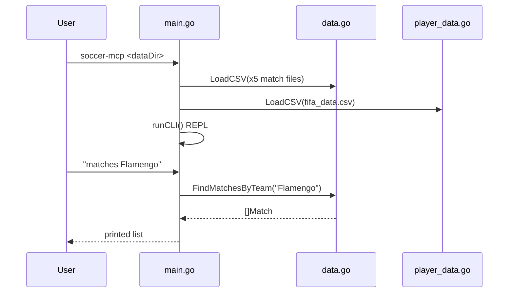

# Flow

`main()` sets `dataDir` from `os.Args[1]` (default `.`), then `Server.Listen()` loads all
6 CSVs into in-memory slices and enters an interactive stdin REPL. Each command does a
linear scan over the loaded slices (substring, case-insensitive matching). Deviations from
the spec: the "MCP server" is not implemented — no MCP/JSON-RPC transport or tool registry
exists, so the program is a local CLI rather than an MCP server; there is no
head-to-head, no competition filter, and no date-range match query surfaced.
