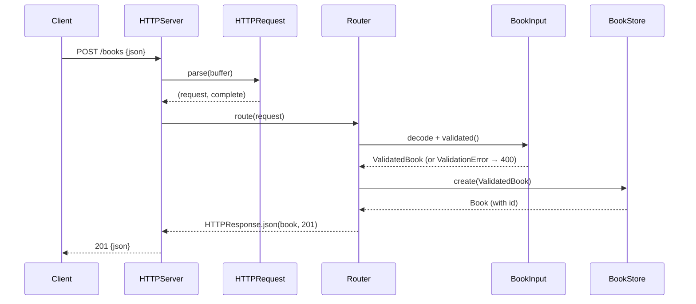

# Flow

A request is read from the TCP connection into a growing buffer; `HTTPRequest.parse` returns once the headers and `Content-Length` body are complete. `Router.route` splits the path into segments, decodes the JSON body into `BookInput`, and validates it — a missing/blank title or author short-circuits to a `400`. Valid input is persisted through `BookStore.create`, which serializes all SQLite access through a private dispatch queue, then returns the row with its assigned `id` as `201 Created`. Notable: the server uses `Connection: close` (one request per connection), JSON output is `sortedKeys`, and the store is `@unchecked Sendable` with queue-serialized access rather than a connection pool.
