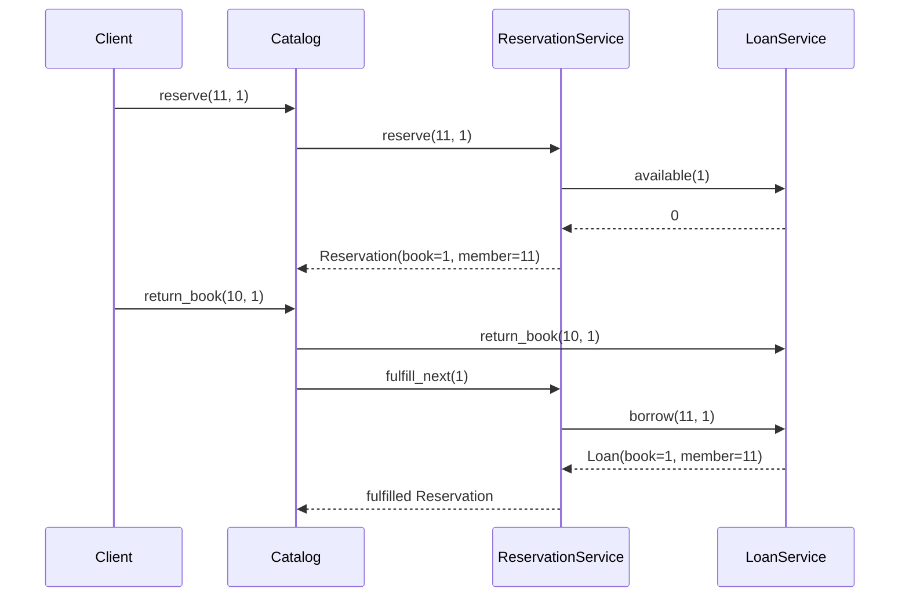

# Flow

The representative flow is reserving an unavailable book and having the
reservation auto-fulfilled on return.

`reserve` first checks the member and book exist, then that availability is 0
(otherwise it raises — the member should borrow), then that the member has no
existing reservation for the book, and appends to the shared reservation list.
On `return_book`, the facade removes the loan (availability momentarily rises to
1) and immediately calls `fulfill_next`, which pops the earliest reservation for
that book and re-borrows the copy for that member, so availability settles back
to 0 and the copy never becomes freely available. FIFO ordering is preserved by
list insertion order; `list_reservations` filters that list by book.
