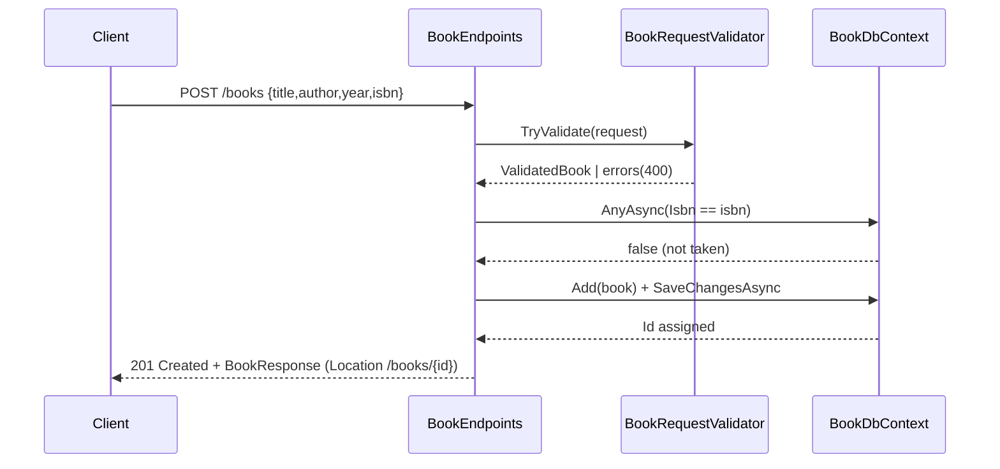

# Flow

A `POST /books` request is bound to a nullable `BookRequest`, validated (title and
author required, ISBN normalized/checked, year range-checked), pre-checked for a
duplicate ISBN, then persisted through EF Core to SQLite. Save is wrapped in a
`TrySaveAsync` that converts a `SQLITE_CONSTRAINT` (19) unique-index violation into
a `409 Conflict`, closing the race between concurrent writers. The handler returns
`201 Created` with a `Location` header. Notable: strongly-typed `TypedResults` union
return types, real DB-touching health check, LIKE-wildcard escaping on the author
filter, and RFC 7807 problem responses throughout.
