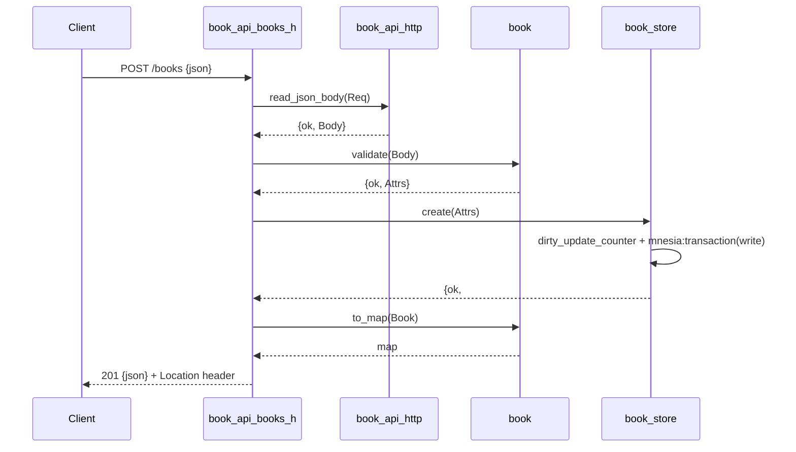

# Flow

A `POST /books` enters `book_api_books_h:init/2`, which wraps the work in `book_api_http:handle/2` (a crash guard converting any exception into a JSON 500). The body is read and JSON-decoded by `book_api_http:read_json_body/1` (empty/oversized/malformed bodies short-circuit to 400/413). `book:validate/1` — a pure function — checks that `title` and `author` are present, non-blank and within length, and normalises `year`/`isbn`; on failure it returns a per-field error list rendered as `400 validation_failed` with a `details` array. On success `book_store:create/1` allocates an id via `mnesia:dirty_update_counter/3` and writes the record inside a Mnesia transaction, then the stored record is rendered with `book:to_map/1` and returned as `201` with a `Location` header.

Deviations / notable characteristics: validation is thorough (required fields, length caps, year range, structural ISBN check) — beyond the spec's minimum. The counter increment is a dirty (non-transactional) operation separate from the transactional write. Reads use `dirty_read`; `list_by_author` filters in Erlang after loading all rows (no indexed query). `HEAD` is accepted alongside `GET`, unsupported methods return `405` with an `Allow` header, and unmatched routes return a JSON `404` rather than Cowboy's default HTML. Persistence is Mnesia `disc_copies` (the language-equivalent embedded DB) rather than SQLite.
